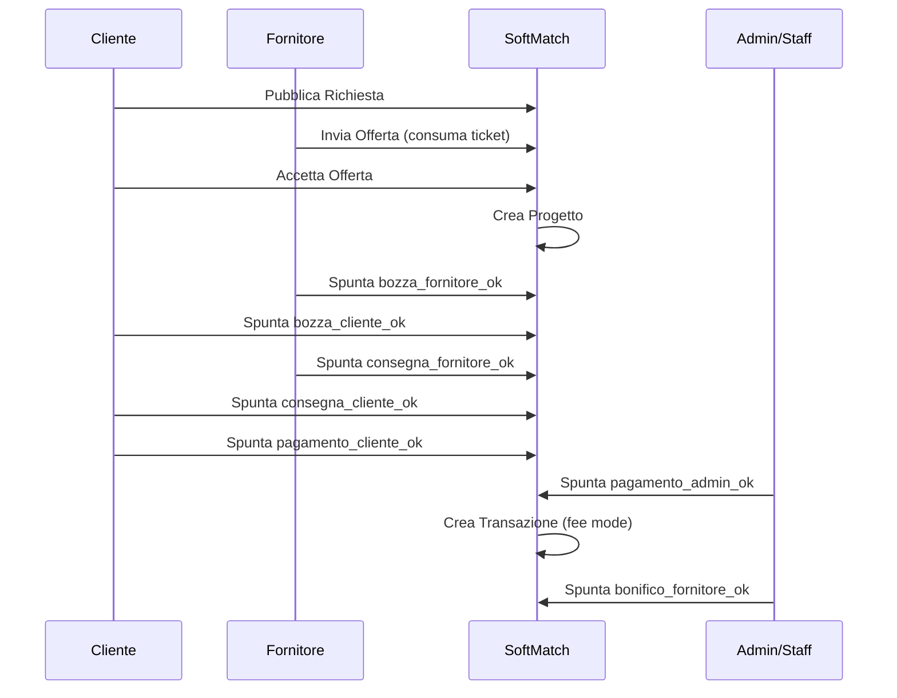

# Workflow Operativo SoftMatch (Cliente / Fornitore / Admin)

## Obiettivo
Definire in modo univoco le fasi operative della piattaforma (dalla richiesta al completamento), il modello di pagamento (fee 5% reale), le policy anti-scavalco e la logica ticket/crediti per invio offerte.

## Attori
- Cliente: pubblica richieste, valuta offerte, gestisce progetto e approvazioni.
- Fornitore: invia offerte (con ticket), esegue consegne e milestone.
- Admin/Staff: supervisione, conferme pagamenti, moderazione e audit.

## Entità principali
- Richiesta: proposta iniziale del cliente.
- Offerta: proposta del fornitore su una richiesta.
- Progetto: nasce dall’accettazione di un’offerta e governa le fasi.
- Transazione: record economico creato a completamento delle condizioni di pagamento/consegna.
- Crediti: saldo ticket del fornitore.
- CreditoMovimento: ledger delle variazioni crediti.

## Regole chiave (policy)
### Fee (5% reale)
La fee è parametrica:
- `SOFTMATCH_PLATFORM_FEE_RATE` (default 0.05)
- `SOFTMATCH_PLATFORM_FEE_MODE`:
  - `cliente` (default): il cliente paga +5%, il fornitore riceve 100%
  - `fornitore`: il cliente paga 100%, il fornitore riceve -5%
  - `split`: cliente +2.5%, fornitore -2.5%

### Anti-scavalco (soft)
- Contatti in Richieste e Offerte vengono mascherati: email, link, numeri.
- In chat progetto, i contatti vengono mascherati finché il pagamento non è avviato (`pagamento_cliente_ok == False`).

### Ticket/Crediti (anti-spam offerte)
- Inviare un’offerta costa `SOFTMATCH_OFFERTA_CREDIT_COST` (default 1).
- Se crediti insufficienti: invio offerta bloccato.
- Ogni variazione crediti è tracciata in `CreditoMovimento`.
- Il cliente non usa crediti: pubblicare una richiesta è gratuito.

### Bonifici (operativo)
- Cliente → SoftMatch (deposito/garanzia):
  - Il cliente effettua bonifico verso l’IBAN SoftMatch durante la fase pagamento.
  - Il cliente carica la ricevuta bonifico nel progetto per velocizzare la verifica.
  - Admin/Staff conferma ricezione (`pagamento_admin_ok`) solo dopo accredito reale.
- SoftMatch → Fornitore (payout):
  - Dopo consegna approvata + pagamento verificato, admin esegue bonifico al fornitore.
  - Il fornitore deve aver inserito IBAN e intestatario nel profilo.
  - Admin carica la ricevuta bonifico (payout) e spunta `bonifico_admin_ok` (“Bonifico inviato”).
  - Il fornitore spunta `bonifico_fornitore_ok` quando riceve effettivamente i fondi.
  - La transazione passa a `completata` dopo la conferma del fornitore.

## Flow end-to-end (alto livello)
```mermaid
flowchart TD
  A[Cliente pubblica Richiesta] --> B[Fornitori inviano Offerte\n(1 ticket ciascuna)]
  B --> C[Cliente confronta e accetta 1 Offerta]
  C --> D[Creazione Progetto]
  D --> E[Bozza iniziale]
  E --> F[Prima release / milestone]
  F --> G[Consegna finale]
  G --> H[Pagamento: cliente + admin]
  H --> I[Transazione creata]
  I --> J[Bonifico fornitore / chiusura]
```

## Fasi di Progetto (stato + checklist)
### Stato: bozza
- Fornitore: carica bozza (flag `bozza_fornitore_ok`)
- Cliente: approva bozza (flag `bozza_cliente_ok`)
- Output: si passa a `prima_release`

### Stato: prima_release
- Fornitore: lavora e consegna (flag `consegna_fornitore_ok`)
- Cliente: valida consegna (flag `consegna_cliente_ok`)
- Output:
  - se pagamenti non ok → stato `pagamento`
  - se pagamenti ok → stato `completato`

### Stato: pagamento
- Cliente: avvia pagamento (flag `pagamento_cliente_ok`)
- Admin/Staff: conferma pagamento (flag `pagamento_admin_ok`)
- Output:
  - quando `consegna_fornitore_ok` + `consegna_cliente_ok` + `pagamento_cliente_ok` + `pagamento_admin_ok` → crea Transazione e passa a `completato`

### Stato: completato
- Admin/Staff: può confermare bonifico fornitore (flag `bonifico_fornitore_ok`)
- Output:
  - Transazione passa a `completata`

## Sequence (chi fa cosa)


## Verifiche Admin (cosa controllare)
- Utenti
  - stato (attivo/sospeso)
  - crediti (ricariche/aggiustamenti) + audit movimenti
- Richieste/Offerte
  - eventuali abusi (spam/offerte inappropriate)
  - mascheramento contatti attivo
- Progetti
  - pagamento_cliente_ok presente prima di pagamento_admin_ok
  - confermare pagamento_admin_ok solo se evidenza pagamento presente (manuale in questa build)
  - gestione dispute (P2)
- Contabilità
  - lista attività “in attesa bonifico cliente”
  - lista attività “da bonificare al fornitore” con IBAN e importo
  - totale margine piattaforma (commissioni) e totale payout

## Cosa manca (prossimi step P2)
- Checkout crediti (pacchetti + pagamento reale) e regole refund: implementata ricarica manuale via bonifico (P2.1). Pagamento online e refund automatici restano P2.
- Dispute workflow con stato dedicato: implementata contestazione con apertura cliente/fornitore e risoluzione admin (P2.1).
- Audit viewer in UI: implementato pannello audit (P2.1).
